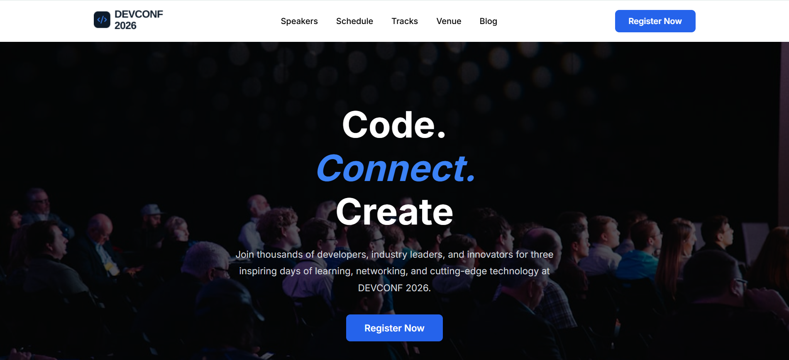
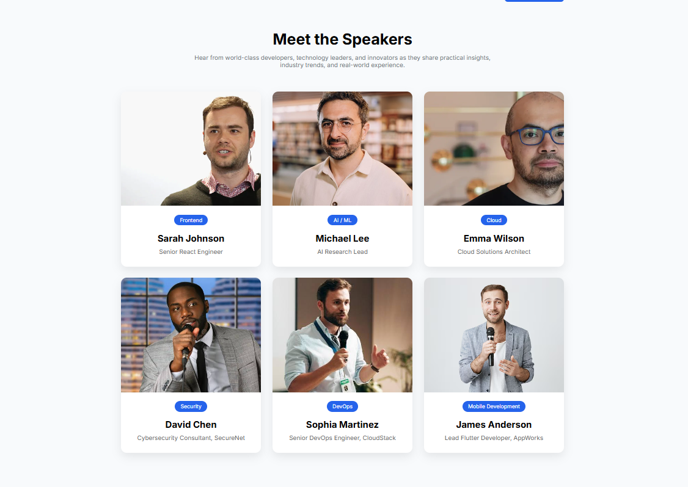
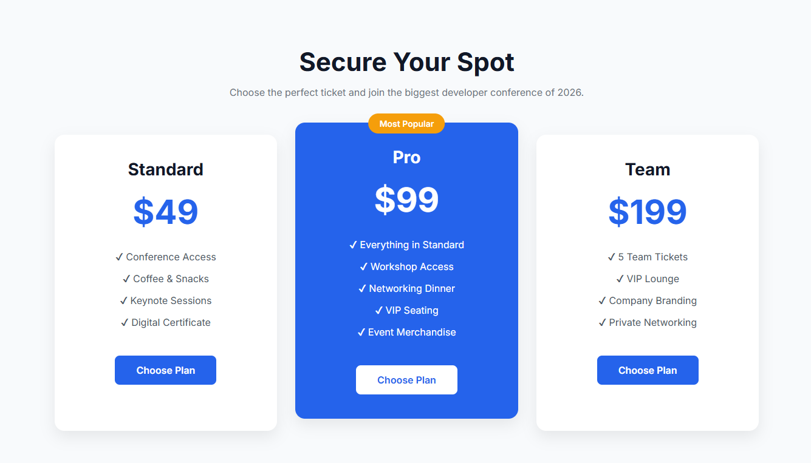
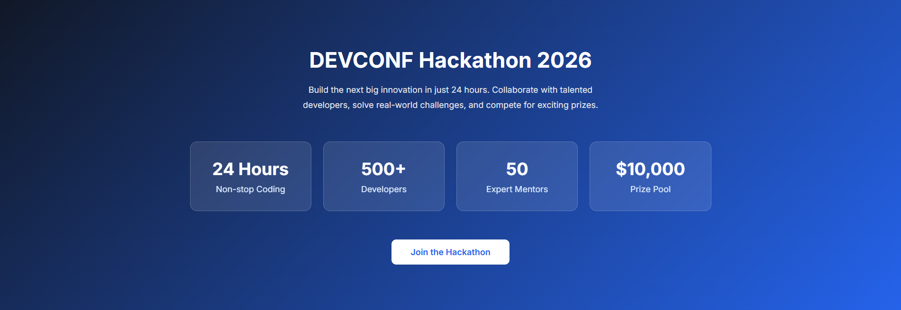

# 🚀 DEVCONF 2026 – Conference Landing Page

A modern, responsive conference landing page built using **HTML5** and **CSS3**. This project was created as part of a frontend web development assignment and follows all the required design specifications without using JavaScript or CSS frameworks.

---

## 🌐 Live Demo

- **Live Site:** https://mintusikder.github.io/dev-conf/
- **GitHub Repository:** https://github.com/mintusikder/dev-conf

---

## 📌 Project Overview

DEVCONF 2026 is a fictional technology conference website designed to provide information about the event, featured speakers, ticket pricing, and an exciting hackathon. The website focuses on clean UI, and modern layout techniques using only HTML and CSS.

---

## ✨ Features

- ✅ Navigation Bar
- ✅ Full-screen Hero Banner with Background Image
- ✅ Meet the Speakers Section
- ✅ Hackathon 2026 (AI Challenge Section)
- ✅ Pricing Plans (Standard, Pro, Team)
- ✅ Professional Footer with Social Media Links
- ✅ Clean and Semantic HTML Structure
- ✅ Modern CSS using Flexbox and Grid Layout

---

## 🛠️ Technologies Used

- HTML5
- CSS3
- Flexbox
- CSS Grid
- Google Fonts

---

## 📂 Project Structure

```text
devconf-2026/
│
├── index.html
├── README.md
├── css/
│   └── style.css
│
├── images/
│   ├── logo.png
│   ├── hero.jpg
│   ├── speaker1.png
│   ├── speaker2.png
│   ├── speaker3.png
│   ├── speaker4.png
│   ├── speaker5.png
│   └── speaker6.png
│
└── screenshots/
    ├── homepage.png
    ├── speakers.png
    ├── pricing.png
    └── hackathon.png
```

---

## 🚀 Getting Started

Follow these steps to run the project on your local machine.

### 1. Clone the Repository

```bash
git clone https://github.com/mintusikder/dev-conf.git
```

### 2. Navigate to the Project Folder

```bash
cd dev-conf
```

### 3. Open the Project

Open the project in **Visual Studio Code**.

```bash
code .
```

### 4. Run the Project

This project is built with **HTML5** and **CSS3**, so no installation is required.

You can run the project by:

- Opening `index.html` directly in your browser, or
- Using the **Live Server** extension in Visual Studio Code.

---

## 🤖 AI Challenge Section

For the AI Challenge requirement, a **Hackathon 2026** section was designed to showcase an exciting coding competition.

The section includes:

- 🚀 Event Introduction
- 📊 Four Statistics Cards
- 🎯 Call-to-Action Button
- 🎨 Modern Gradient Background

---

## 💡 AI Prompt Used

**Prompt:**

> Create a modern Hackathon section for a DEVCONF 2026 landing page using only HTML and CSS. The section should have a dark gradient background, a centered heading, a short description, four statistic cards (24 Hours, 500+ Developers, 50 Mentors, $10,000 Prize Pool), and a prominent "Join the Hackathon" button. The design should be clean, responsive, and suitable for a professional technology conference website.

---

## 🎯 Assignment Requirements Covered

- Navbar
- Hero Banner
- Meet the Speakers Section
- AI Generated Section (Hackathon)
- Pricing Section
- Footer Section
- Semantic HTML
- CSS Flexbox
- CSS Grid
- No JavaScript
- No CSS Framework

---

## 📸 Screenshots

### 🏠 Homepage



---

### 🎤 Speakers Section



---

### 💰 Pricing Section



---

### 🚀 Hackathon Section



---

## 👨‍💻 Author

**Mintu Sikder**

- 🎓 B.Sc. in Computer Science and Engineering
- 💻 Frontend Web Developer
- 🌐 GitHub: https://github.com/mintusikder

---

## 📄 License

This project was created for educational purposes as part of a frontend web development assignment.

Feel free to clone, explore, and learn from this project.